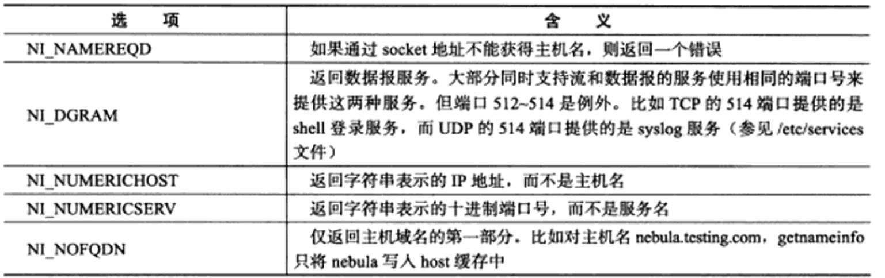

# Linux高性能服务器编程阅读笔记
## 第一章 TCP/IP 协议族
### 1.1 TCP/IP 协议族体系结构以及主要协议
TCP/IP 是一个四层协议体系结构，分别是：应用层、传输层、网络层和数据链路层。

#### 1.1.1 数据链路层
数据链路层处理数据在物理媒介上的传输。
两个常用的协议是 ARP 协议 (Address Resolution Protocol，地址解析协议) 和 RARP 协议 (Reverse Address Resolution Protocol，逆地址解析协议)。实现了 IP 地址和机器物理地址之间的相互转换。
#### 1.1.2 网络层
网络层的主要协议是 IP 协议。 IP 协议根据数据包 IP 决定下一跳的路径。
网络层的另一个协议是 ICMP 协议 (Internet Control Message Protocol，Internet 控制报文协议)。 ICMP 协议用于网络故障的诊断和报告。
#### 1.1.3 传输层
传输层的主要协议是 TCP 协议和 UDP 协议和 SCTP 协议。
传输层提供端到端的通信，传输层只关心两个主机之间的通信，而不关心网络中间的路由。
#### 1.1.4 应用层
应用层负责处理应用程序的逻辑如文件传输、名称查询、网络管理等。
### 1.2 封装
应用程序数据在经过各层协议从上往下传输时，每层协议都会在数据包上加上自己的头部信息，以实现该层的功能，这个过程叫做封装。

### 1.3 分用
数据包在经过各层协议从下往上传输时，每层协议都会根据头部信息识别自己的数据，然后去掉头部信息，这个过程叫做分用。


## 第四章 TCP/IP 通信案例：访问 Internet 上的 Web 服务器
#### 4.2.1 HTTP 代理服务器的工作原理
HTTP 代理服务器是介于客户端和服务器之间的一台服务器，客户端发送请求到代理服务器，代理服务器再发送请求到服务器，服务器返回数据到代理服务器，代理服务器再返回数据到客户端。
代理服务器分为正向代理和反向代理。
正向代理：代理服务器代理客户端访问服务器。
反向代理：代理服务器代理服务器访问客户端。
## 第五章 Linux 网络编程基础 API
#### 5.1.1 主机字节序和网络字节序
字节序是指数据在内存中的存储顺序。字节序分为大端字节序和小端字节序。大端字节序是指数据的高位字节存储在低地址，小端字节序是指数据的高位字节存储在高地址。
PC 机是小端字节序，网络字节序是大端字节序。
Linux 提供了一些函数用于主机字节序和网络字节序之间的转换。
```C++
#include <arpa/inet.h>
uint32_t htonl(uint32_t hostlong);
uint16_t htons(uint16_t hostshort);
uint32_t ntohl(uint32_t netlong);
uint16_t ntohs(uint16_t netshort);
```
```C++
#include<netinet/in.h>
unsigned long int htonl(unsigned long int hostlong);
unsigned short int htons(unsigned short int hostshort);
unsigned long int ntohl(unsigned long int netlong);
unsigned short int ntohs(unsigned short int netshort);
```
#### 5.1.2 通用 socket 地址
通用 socket 地址是一个结构体，用于存储 socket 地址信息。
```C++
#include<bits/socket.h>
struct sockaddr {
    sa_family_t sa_family; 
    /* 
    sa_family_t 是地址族类型
    地址族类型通常与协议对应
    PF_INET: AF_INET: IPv4
    PF_INET6: AF_INET6: IPv6
    PF_UNIX: AF_UNIX: Unix 域
    */
    unsigned long int __ss_align;
    char __ss_padding[128 - sizeof(sa_family_t)];
    // 该结构体提供了一个通用的地址结构，用于存储各种协议的地址信息
    // 并且内存对齐。
};
```
#### 5.1.3 专用 socket 地址
专用 socket 地址是一个结构体，用于存储 socket 地址信息。
```C++
#include<netinet/in.h>
// UNIX 本地域协议族使用如下 socket 地址结构体

struct sockaddr_un {
    sa_family_t sun_family; // 地址族类型
    char sun_path[108]; // 地址信息
};
```
#### 5.1.4 地址转换
```C++
#include<arpa/inet.h>
int inet_pton(int af, const char *src, void *dst);
in_addr_t inet_addr(const char *cp);
char *inet_ntoa(struct in_addr in);
int inet_aton(const char *cp, struct in_addr *inp);
//函数命名规则为 inet_ + 功能
// inet_pton: 将点分十进制字符串转换为网络字节序的整数
// inet_addr: 将点分十进制字符串转换为网络字节序的整数
// inet_ntoa: 将网络字节序的整数转换为点分十进制字符串
// inet_aton: 将点分十进制字符串转换为网络字节序的整数
```
### 5.2 创建命名socket
```C++
#include<sys/types.h>
#include<sys/socket.h>
int socket(int domain, int type, int protocol);
int bind(int sockfd, const struct sockaddr *addr, socklen_t addrlen);
// bind 函数用于将 socket 绑定到一个地址
// 将 addr 指向的地址绑定到 sockfd 指向的 socket 上
// addrlen 为地址长度
```
### 5.4 监听socket
socket 被创建后，需要调用 listen 函数将 socket 变为监听 socket。
```C++
#include<sys/socket.h>
int listen(int sockfd, int backlog);
// backlog 为监听队列的最大长度
```
```C++
// 一个简单的服务器程序
#include <sys/socket.h>
#include <netinet/in.h>
#include <arpa/inet.h>
#include <signal.h>
#include <unistd.h>
#include <assert.h>
#include <stdio.h>
#include <stdlib.h>
#include <string.h>
/// @brief 
static bool stop = false;
static void handle_term(int sig) {
    stop = true;
}


int main(int argc, char* argv[]) {
    signal(SIGTERM, handle_term);
    if (argc <= 3) {
        printf("usage: %s ip_address port_number backlog\n", basename(argv[0]));
        return 1;
    }
    const char* ip = argv[1];
    int port = atoi(argv[2]);
    int backlog = atoi(argv[3]);
    int sock = socket(PF_INET, SOCK_STREAM, 0);
    assert(sock >= 0);
    struct sockaddr_in address;
    bzero(&address, sizeof(address));
    address.sin_family = AF_INET;
    inet_pton(AF_INET, ip, &address.sin_addr);
    address.sin_port = htons(port);
    int ret = bind(sock, (struct sockaddr*)&address, sizeof(address));
    assert(ret != -1);
    ret = listen(sock, backlog);
    assert(ret != -1);
    while (!stop) {
        sleep(1);
    }
    close(sock);
    return 0;
}
```
以上程序用来监听一个端口，当接收到 SIGTERM 信号时，程序退出。

### 5.5 接受连接
```C++
#include<sys/types.h>
#include<sys/socket.h>
int accept(int sockfd struct sockaddr *addr, socklen_t *addrlen);
// sockfd 为监听 socket
/// addr 为客户端地址
// addrlen 为客户端地址长度
```
```C++
#include <sys/socket.h>
#include <netinert/in.h>
#include <arpa/inet.h>
#include <assert.h>
#include <stdio.h>
#include <errno.h>
#include <string.h>

int main(int argc, char* argv[]) {
    if (argc <= 2) {
        printf("usage: %s ip_address port_number\n", basename(argv[0]));
        return 1;
    }
    const char* ip = argv[1];
    int port = atoi(argv[2]);
    struct sockaddr_in address;
    bzero(&address, sizeof(address));
    address.sin_family = AF_INET;
    int sock = socket(PF_INET, SOCK_STREAM, 0);
    assert(sock >= 0);
    inet_pton(AF_INET, ip, &address.sin_addr);
    address.sin_port = htons(port);
    int ret = bind(sock, (struct sockaddr*)&address, sizeof(address));
    assert(ret != -1);
    ret = listen(sock, 5);
    assert(ret != -1);
    sleep(20);
    struct sockaddr_in client;
    socklen_t client_addrlength = sizeof(client);
    int connfd = accept(sock, (struct sockaddr*)&client, &client_addrlength);
    if (connfd < 0) {
        printf("errno is: %d\n", errno);
    } else {
        char remote[INET_ADDRSTRLEN];
        printf("connected with ip: %s and port: %d\n", inet_ntop(AF_INET, &client.sin_addr, remote, INET_ADDRSTRLEN), ntohs(client.sin_port));
        close(connfd);
    }
    close(sock);
    return 0;
}
```
### 5.6 发起连接

```C++
#include <sys/types.h>
#include <sys/socket.h>
int connect(int sockfd, const struct sockaddr *addr, socklen_t addrlen);
// sockfd 为 socket
// serv_addr 为服务器监听的socket地址
```

### 5.7 关闭连接
```C++
#include <unistd.h>
int close(int fd);
// fd 参数为待关闭的文件描述符
// 不过close函数并不会立即关闭文件，而是将文件描述符的引用计数减一
// 当引用计数为 0 时，才会关闭文件
// 多进程中一次fork会将文件描述符的引用计数加一
// 因此只有当所有进程都关闭文件描述符时，文件才会真正关闭
#include <sys/socket.h>
int shutdown(int sockfd,int howto);
// 该函数无论如何都会关闭文件
// howto 决定了shutdown的行为
// howto 为 SHUT_RD 时，关闭读端
// howto 为 SHUT_WR 时，关闭写端
// howto 为 SHUT_RDWR 时，关闭读写端
// close只能同时关闭读写端
```

### 5.8 数据读写
#### 5.8.1 TCP数据读写
```C++
#include <sys/types.h>
#include <sys/socket.h>
ssize_t recv(int sockfd, void *buf, size_t len, int flags);
ssize_t send(int sockfd, const void *buf, size_t len, int flags);
// recv 函数用于从 sockfd 指向的 socket 中读取数据
// send 函数用于向 sockfd 指向的 socket 中写入数据
// buf 为数据缓冲区的位置
// len 为数据缓冲区的长度
// flags 为操作标志 通常为0
// flag 参数为 0 时，表示默认操作
```

```C++ 
const char* oob_data = "abc";
const char* normal_data = "123";
send(connfd, normal_data, strlen(normal_data), 0);
send(connfd, oob_data, strlen(oob_data), MSG_OOB);
send(connfd, normal_data, strlen(normal_data), 0);
```
```C++
char buffer[BUF_SIZE];
memset(buffer, '\0', BUF_SIZE);
ret = recv(connfd, buffer, BUF_SIZE - 1, 0);
printf("got %d bytes of normal data '%s'\n", ret, buffer);
memset(buffer, '\0', BUF_SIZE);
ret = recv(connfd, buffer, BUF_SIZE - 1, MSG_OOB);
printf("got %d bytes of oob data '%s'\n", ret, buffer);
memset(buffer, '\0', BUF_SIZE);
ret = recv(connfd, buffer, BUF_SIZE - 1, 0);
printf("got %d bytes of normal data '%s'\n", ret, buffer);
close(connfd);
```
运行结果
```shell
got 5 byresof normal data '123ab'
got 1 bytes of oob data 'c'
got 3 bytes of normal data '123'
```
因为带外数据和普通数据是混在一起的，所以abc被插入了普通数据流中，因为带外数据只有一个字节的缓冲区，所以最后只有C被认为是带外数据。

#### 5.8.2 UDP 数据读写
```C++
#include <sys/types.h>
#include <sys/socket.h>
ssize_t recvfrom(int sockfd, void *buf, size_t len, int flags, struct sockaddr *src_addr, socklen_t *addrlen);
ssize_t sendto(int sockfd, const void *buf, size_t len, int flags, const struct sockaddr *dest_addr, socklen_t addrlen);
```
因为UDP通信没有连接的概念，所以UDP通信需要在每次通信时指定目标地址。即src_addr 地址内容和addrlen 地址长度。

这两个函数也可以用于TCP通信，但是TCP通信中不需要指定目标地址，因为TCP通信是面向连接的。只需要把src_addr 和 addrlen 设置为NULL即可。

#### 5.8.3 通用数据读写
```C++
#include <sys/socket.h>
ssize_t recvmsg(int sockfd, struct msghdr *msg, int flags);
ssize_t sendmsg(int sockfd, const struct msghdr *msg, int flags);
```
这两个函数可以用于TCP和UDP通信，msg 参数是一个结构体，用于存储数据的缓冲区和地址信息。
```C++
struct msghdr {
    void *msg_name; // 指向目标地址的指针
    socklen_t msg_namelen; // 目标地址的长度
    struct iovec *msg_iov; // 数据缓冲区
    int msg_iovlen; // 分散读写的缓冲区数量
    struct cmsghdr *msg_control; // 控制信息
    socklen_t msg_controllen; // 控制信息长度
    int msg_flags; // 操作标志
};
```
msg_iov 指向一个 iovec 结构体数组，用于存储数据缓冲区的位置和长度。
```C++
struct iovec {
    void *iov_base; // 数据缓冲区的位置
    size_t iov_len; // 数据缓冲区的长度
};
```


### 5.9 带外标记

```C++
#include <sys/socket.h>
int sockatmark(int sockfd);
```
sockatmark 函数用于判断 sockfd 指向的 socket 是否处于带外标记位置。如果返回值为1就可以用带 MSG_OOB 参数的 recv 函数读取带外数据。

### 5.10 地址信息函数
```C++
#include <sys/socket.h>
int getsockname(int sockfd, struct sockaddr *addr, socklen_t *addrlen);
int getpeername(int sockfd, struct sockaddr *addr, socklen_t *addrlen);
```
getsockname 函数用于获取 sockfd 指向的 socket 的地址信息并存储到 addr 指向的结构体中。
getpeername 函数用于获取 sockfd 指向的 socket 的对端地址信息并存储到 addr 指向的结构体中。

### 5.11 socket 选项
```C++
#include <sys/socket.h>
int getsockopt(int sockfd, int level, int optname, void *optval, socklen_t *optlen);
int setsockopt(int sockfd, int level, int optname, const void *optval, socklen_t optlen);
```
getsockopt 函数用于获取 sockfd 指向的 socket 的选项信息。
setsockopt 函数用于设置 sockfd 指向的 socket 的选项信息。
level 参数指定要操作哪个协议的选项比如IPv4，IPv6，TCP，UDP等。option 指定了选项的名字


#### 5.11.1 SO_REUSEADDR 选项
TCP连接的TIME_WAIT状态，可以通过设置socket选项SO_REUSEADDR来强制使用被处于TIME_WAIT状态的连接占用的socket地址。
```C++
int sock = socket(PF_INET, SOCK_STREAM, 0);
assert(sock >= 0);
int reuse = 1;
setsockopt(sock, SOL_SOCKET, SO_REUSEADDR, &reuse, sizeof(reuse));
struct sockaddr_in address;
bzero(&address, sizeof(address));
address.sin_family = AF_INET;
inet_pton(AF_INET, ip, &address.sin_addr);
address.sin_port = htons(port);
int ret = bind(sock, (struct sockaddr*)&address, sizeof(address));
```
#### 5.11.2 SO_RCVBUF 和 SO_SNDBUF 选项
SO_RCVBUF 和 SO_SNDBUF 选项用于设置接收缓冲区和发送缓冲区的大小。不过当我们用setsockopt函数设置缓冲区大小时，内核会将缓冲区大小设置为我们传入的值和系统默认值中的最大值。
TCP接受缓存区的大小最小值为256字节，发送区的大小最小值为2048字节。这样做的目的主要是确保一个TCP连接拥有足够的缓冲区，以便应对网络瞬时拥塞的情况。
可以直接修改/proc/sys/net/ipv4/tcp_rmem 和 /proc/sys/net/ipv4/tcp_wmem 文件来修改TCP缓冲区的大小。

#### 5.11.3 SO_RCVDLOWAT 和 SO_SNDLOWAT 选项
SO_RCVLOWAT 和 SO_SNDLOWAT 选项用于设置接收缓冲区和发送缓冲区的下限。当接收缓冲区中的数据大于SO_RCVLOWAT时，recv函数会返回。当发送缓冲区中的数据小于SO_SNDLOWAT时，send函数会返回。
#### 5.11.4 SO_LINGER 选项
SO_LINGER 选项用于控制close函数的行为。
```C++
struct linger {
    int l_onoff; // 0 or 1
    int l_linger; // 超时时间
};
```
根据linger结构体的成员变量的不同值clos会产生以下三种行为
- l_onoff等于0 close用默认方式关闭socket
- l_onoff等于1 l_linger等于0 close立即关闭socket，丢弃未发送的数据，并发送复位报文。
- l_onoff等于1 l_linger大于0 close会等待l_linger秒，等待数据发送完毕后再关闭socket，如果超时则丢弃未发送的数据，并发送复位报文。close将返回-1，errno被设置为EWOULDBLOCK。需要根据返回值和errno来判断是否发送完毕。
### 5.12 网络信息API
socket 地址的两个要素，即IP地址和端口号，都是用数值表示的，因此可以通过服务名称代替端口号。
```shell
telnet 127.0.0.1 80
telnet localhost www
```
上面的例子中，telnet客户端调用了某些网络信息API来实现主机名到IP地址的转换，以及服务名到端口号的转换。
##### 5.12.1 gethostbyname 和 gethostbyaddr 函数
```C++
#include <netdb.h>
struct hostent *gethostbyname(const char *name);
struct hostent *gethostbyaddr(const char *addr, socklen_t len, int family);
```
gethostbyname 函数用于通过主机名获取主机信息。
gethostbyaddr 函数用于通过IP地址获取主机信息。

gethostbyname 通常在本地的 /etc/hosts 配置文件中查找主机，如果没有找到则通过DNS服务器查找。

函数的返回值是一个 hostent 结构体指针，该结构体定义如下：
```C++
struct hostent {
    char *h_name; // 主机名
    char **h_aliases; // 主机别名
    int h_addrtype; // 地址类型
    int h_length; // 地址长度
    char **h_addr_list; // 地址列表
};
```
#### 5.12.2 getservbyname 和 getservbyport 函数

```C++
#include <netdb.h>
struct servent *getservbyname(const char *name, const char *proto);
struct servent *getservbyport(int port, const char *proto);
```
getservbyname 函数用于通过服务名获取服务信息。
getservbyport 函数用于通过端口号获取服务信息。

函数的返回值是一个 servent 结构体指针，该结构体定义如下：
```C++
struct servent {
    char *s_name; // 服务名
    char **s_aliases; // 服务别名
    int s_port; // 端口号
    char *s_proto; // 协议
};
```

#### 5.12.3 getaddrinfo
```C++
#include <netdb.h>
int getaddrinfo(const char *node, const char *service, const struct addrinfo *hints, struct addrinfo **res);
```

getaddrinfo 函数用于将主机名和服务名转换为套接字地址结构体的列表。node 参数为主机名，service 参数为服务名，hints 参数为一个 addrinfo 结构体，用于指定期望的返回结果。res 参数为一个指向 addrinfo 结构体指针的指针，用于存储返回结果。
getaddrinfo 反馈的结果是一个 addrinfo 结构体链表，该结构体定义如下：

```C++
struct addrinfo {
    int ai_flags; // 标志
    int ai_family; // 地址族
    int ai_socktype; // 套接字类型
    int ai_protocol; // 协议
    socklen_t ai_addrlen; // 地址长度
    struct sockaddr *ai_addr; // 地址
    char *ai_canonname; // 主机名
    struct addrinfo *ai_next; // 下一个 addrinfo 结构体
};
```
ai_protocol 参数用于指定协议，如果为0则表示任意协议。ai_socktype 参数用于指定套接字类型，如果为0则表示任意套接字类型。ai_family 参数用于指定地址族，如果为0则表示任意地址族。
ai_flag 参数用于指定标志，可以是以下值的组合：

```
struct addrinfo hints;
struct addrinfo *result;
bzreo(&hints, sizeof(hints));
hints.ai_family = AF_UNSPEC;
hints.ai_socktype = SOCK_STREAM;
getaddrinfo("www.baidu.com", "daytime", &hints, &result);
```
getaddrinfo 将隐式的分配堆内存，所以需要调用 freeaddrinfo 函数来释放内存。
```C++
void freeaddrinfo(struct addrinfo* res);
```

#### 5.12.4 getnameinfo
getnameinfo 函数用于将套接字地址结构体转换为主机名和服务名。
```C++
#include <netdb.h>
int getnameinfo(const struct sockaddr *sa, socklen_t salen, char *host, socklen_t hostlen, char *serv, socklen_t servlen, int flags);
```
sa 参数为套接字地址结构体，salen 参数为套接字地址结构体的长度，host 参数用于存储主机名，hostlen 参数为主机名的长度，serv 参数用于存储服务名，servlen 参数为服务名的长度，flags 参数为操作标志。

getnameinfo 将返回的主机名和服务名存储到 host 和 serv 指向的缓冲区中。 

getaddrinfo 和 getnameinfo 失败的错误码如下

下面的函数可以将错误码errno转换为字符串
```C++
#include <netdb.h>
const char *gai_strerror(int errcode);
```

## 第六章 高级 I/O 函数
### 6.1 pipe 函数
pipe 函数用于创建一个管道，用于进程间通信，管道是一个半双工的通信通道，数据只能单向流动。
```C++
#include <unistd.h>
int pie( int pipefd[2]);
```
### 6.2 dup 函数和 dup2 函数
```C++ 
#include <unistd.h>
int dup(int file_descriptor);
int dup2(int file_descriptor, int file_descriptor2);
```
dup 函数用于复制一个文件描述符，返回值为新的文件描述符。
dup2 函数用于复制一个文件描述符，但是可以指定新的文件描述符。

### 6.3 readv 函数和 writev 函数
```C++
#include <sys/uio.h>
ssize_t readv(int file_descriptor, const struct iovec *iov, int iovcnt);
ssize_t writev(int file_descriptor, const struct iovec *iov, int iovcnt);
```
### 6.4 sendfile 函数
```C++
#include <sys/sendfile.h>
ssize_t sendfile(int out_fd, int in_fd, off_t *offset, size_t count);
```
### 6.5 mmap 函数和 munmap 函数
```C++
#include <sys/mman.h>
void *mmap(void *addr, size_t length, int prot, int flags, int fd, off_t offset);
int munmap(void *addr, size_t length);
```
### 6.6 splice 函数
```C++
#include <fcntl.h>
ssize_t splice(int fd_in, loff_t *off_in, int fd_out, loff_t *off_out, size_t len, unsigned int flags);
```
### 6.7 tee 函数
```C++
#include <fcntl.h>
ssize_t tee(int fd_in, int fd_out, size_t len, unsigned int flags);
```

### 6.8 fcntl 函数
```C++
#include <fcntl.h>
int fcntl(int fd, int cmd, ...);
```

## 第七章 Linux 服务器程序规范
服务器会涉及一些细节问题，基本是模板式的，所以我们称之为服务器规范，比如：
- Linux 服务器基本以后台进程的形式运行，又称为守护进程。没有控制终端，也不会意外接收到用户输入。守护进程的父进程通常是 init 进程(PID 为1)。
- Linux 服务器有一套日志系统，至少能输出日志到文件，有的高级服务器还会输出日志到专门的日志服务器。大部分后台进程都在/var/log 目录下创建日志文件。
- Linux 服务器一般以某个特定用户的身份运行，这个用户通常是一个普通用户，而不是 root 用户。这样即使服务器被攻破，攻击者也只能以普通用户的身份运行。
- Linux 服务器通常是可以配置的。如果一次运行的选项太多，可以用配置文件来管理，服务器会有一个配置文件，用于配置服务器的行为，比如端口号，日志文件路径等。
- Linux 服务器进程通常会有一个 PID 文件，用于存储服务器进程的 PID，这样可以方便地管理服务器进程，比如关闭服务器进程。
- Linux 服务器程序桶醋需要考虑系统资源和限制，以预测自身能承受多大负荷。
### 7.1 日志
#### 7.1.1 Linux 系统日志
Linux 提供一个守护进程来处理系统日志--syslogd，现在linux系统用的是它的升级版--rsyslogd
rsyslogd 守护进程，既能接受用户进程输出的日志，又能接收内核日志。

#### 7.1.2
应用程序使用 syslog 函数与rsyslogd 守护进程用心。syslog 函数的定义如下：
```C++
#include <syslog.h>
void syslog(int priority, const char *format, ...);
```


### 7.2 用户信息
#### 7.2.1 UID、EUID、GID 和 EGID

#### 7.2.2 切换用户
```C++
static bool switch_to_user( uid_t user_id, git_t gp_id) {
    //如果不是root用户
    if((user_id == 0) && (gp_id == 0)) {
        return false;
    }
    gid_t gid = getgid();
    uid_t uid = getuid();
    // 确保当前用户是合法用户: root 或者目标用户
    if(((gid != 0) || (uid != 0)) && ((gid != gp_id) || (uid != user_id))) {
        return false;
    }
    // 如果不是root 则已经是目标用户
    if（uid != 0) {
        return true;
    }
    // 切换到目标用户
    if((setgid(gp_id) < 0) || (setuid(user_id) < 0)) {
        return false;
    }
}
```
### 7.3 进程间关系
#### 7.3.1 进程组
每个进程都属于一个进程组，进程组是一个或多个进程的集合，每个进程组有一个组长进程，组长进程的 PID 等于进程组的 ID。
#### 7.3.2 会话
会话是一个或多个进程组的集合，每个会话有一个会话首进程，会话首进程的 PID 等于会话的 ID。
#### 7.3.3 用ps查看进程信息
```shell
ps -o pid,ppid,pgid,sid,comm | less
PID PPID PGID SID COMMAND
xxx xxxx xxxx xxx bash
```

### 7.4 系统资源限制
Linux 上运行的程序都会受到资源限制的影响，比如物理设备限制，系统策略限制，以及具体实现的限制。
```C++
#include <sys/resource.h>
int getrlimit(int resource, struct rlimit *rlim);
int setrlimit(int resource, const struct rlimit *rlim);
struct rlimit {
    rlim_t rlim_cur; // 软限制
    rlim_t rlim_max; // 硬限制
};
```

### 7.5 改变工作目录和根目录
有些服务器程序还需要改变工作目录和根目录
```C++
#include <unistd.h>
char* getcwd(char *bug, size_t size);
int chdir(const char* path);
int chroot(const char* path);
```
### 7.6 服务器程序后台化
如何让一个进程以守护进程的方式运行，守护进程的编写遵循一定的步骤，下面是代码实例
```C++
bool daemonsize() {
    pid_t pid = fork();
    // 创建子进程，关闭父进程，这样可以让程序在后台运行
    if( pid < 0) {
        return false;
    } else if(pid > 0) {
        exit(0);
    }
    // 设置文件权限掩码，防止文件被其他用户访问
    umask(0);
    // 创建新的会话，脱离控制终端
    pid_t sid = setsid();
    if(sid < 0) {
        return false;
    }
    // 切换工作目录
    if((chdir("/") < 0)) {
        return false;
    }
    // 关闭标准输入，输出，错误输出
    close(STDIN_FILENO);
    close(STDOUT_FILENO);
    close(STDERR_FILENO);
    // 关闭其他文件描述符
    open("/dev/null", O_RDONLY);
    open("/dev/null", O_RDWR);
    open("/dev/null", O_RDWR);   
    // dup2(STDIN_FILENO, STDOUT_FILENO);
    // dup2(STDIN_FILENO, STDERR_FILENO);
    return true;
}
```
```C++
#include <unistd.h>
int daemon(int nochdir, int noclose);
```
## 第八章 高性能服务器框架

### 8.1 服务器模型
#### 8.1.1 C/S 模型
TCP/IP 协议在设计和实现上并没有客户端和服务器的概念，在通信过程中所有机器都是对等的，但由于数据都被数据提供者所垄断，所以几乎所有的网络应用程序都采用了 C/S 模型，所有客户端通过访问服务器获取资源。

服务器同时监听多个客户请求是通过select系统调用实现的。